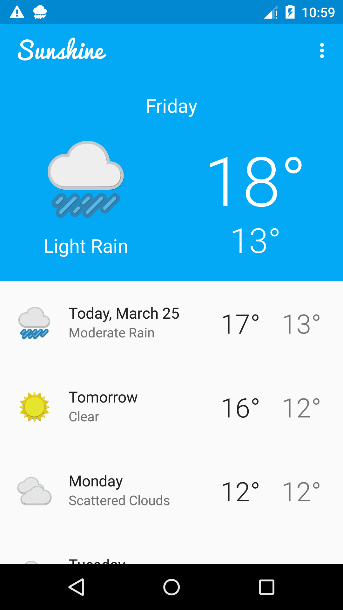
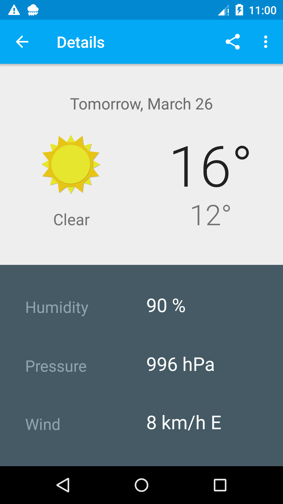
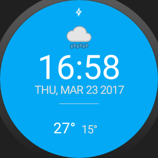
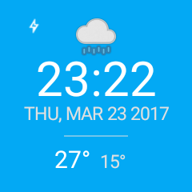

# GoUbiquitous

* [About](#about)
* [What will I learn](#what-will-i-learn)
* [Required Tasks check list](#required-tasks-check-list)
* [Rubric check list](#rubric-check-list)
* [Screenshots](#screenshots)
* [Implementation](#implementation)
* [Using the Emulator](#using-the-emulator)
* [Todo](#todo)


## About

This project is part of the [Udacity Android Developer Nanodegree](https://www.udacity.com/course/android-developer-nanodegree-by-google--nd801) under the name - Project P6: Go Ubiquitous.

### Project Overview:
In this project, I  will build a wearable watch face for Sunshine to run on an Android Wear device.

### Why this Project?
Android Wear is an exciting way to integrate your app more directly into users’ lives. As a new developer, it will be important for you to understand how to perform this integration. This project gives you an opportunity to design a companion app for Sunshine, tying it to a watch face in order to enrich the experience.

## What will I learn?

Through this project, I Will:

* Understand the fundamentals of Android Wear.
* Design for multiple watch form factors.
* Communicate between a mobile device and a wearable device.


## Required tasks check list

- [x] Clone/Download a zip file of the [Sunshine repository](https://github.com/udacity/ud851-Sunshine/tree/student).
- [x] Build your code starting from the project in the **S12.04-Solution-ResourceQualifiers** folder.
- [x] Spend time exploring the samples built into Android Studio, looking for ways to incorporate that functionality into an Android Wear watchface.


## Rubric Check list
- [x] App works on both round and square face watches.
- [x] App displays the current time.
- [x] App displays the high and low temperatures.
- [x] App displays a graphic that summarizes the day’s weather (e.g., a sunny image, rainy image, cloudy image, etc.).
- [x] Watch face obtains weather data by talking with a copy of Sunshine running on a device paired to the watch.
- [x] App conforms to common standards found in the [Android Nanodegree General Project Guidelines](http://udacity.github.io/android-nanodegree-guidelines/core.html).


## Screenshots







## Implementation


Linking the Phone application with the Wear application
-------------------------------------------------------

1 - Creates a new wearable module: New -> Module.  
    Provide the new module the same package as the application.  

```java
    package com.example.android.sunshine;
```


2 - Add the dependency to the wear application within the phone app Gradle.
```
dependencies {
    
    wearApp project(':wear')
}
```
    
3 - All the permissions needed by the wear application have to be provided to the phone Application as well in the ```Manifest.xml```  

```xml
<uses-permission android:name="android.permission.WAKE_LOCK" />
``` 
 
## Using the Emulator

*  Install the "Android wear" application in your phone.
*  Turn on the Android wear emulator.
*  Connect the connect the phone with the emulator by using the Android wear application.
*  While the connection is being established, run the following command in the terminal console:  

```
adb -d forward tcp:5601 tcp:5601
```

In general the adb tool is located in:
```
C:\Users\XXXXX\AppData\Local\Android\sdk\platform-tools\
```


